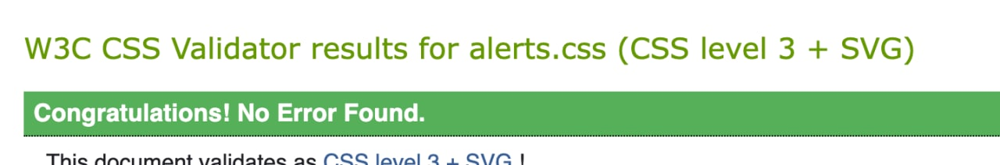
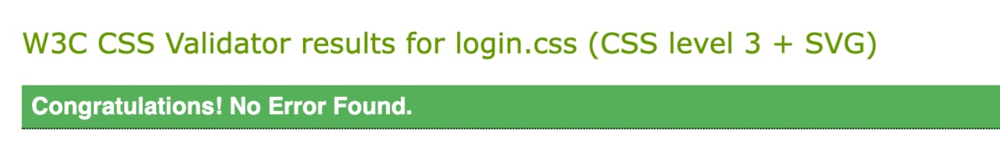
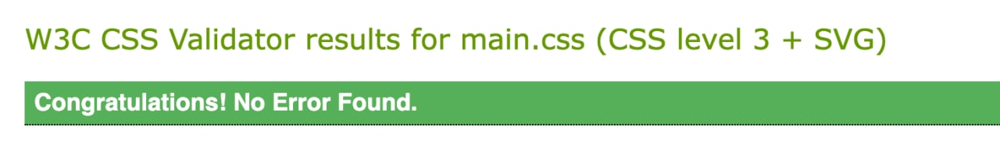

[//]: # (Create h1 heading with the name of the project)

# Project for Web Application subject at the Technical University of Liberec

[//]: # (Add badges for the project)
[//]: # (Badges are used to show the status of the project)
[//]: # (Badges are created using https://shields.io/)

[//]: # (Add description of the project)

## Description

Zobrazení úkolů
filtr splněných / nesplněných úkolů 
možnost zobrazení výstupu ve formátech HTML a JSON. Výstupy musí být dostupné na samostatných URL a mít správný content-type. 
všechny výstupy (HTML, CSS, JSON) musí být validní dle pravidel příslušného jazyka
administrace úkolů - přidání, úprava, smazání, označit jako hotový (CRUD)
přihlášení uživatele, zabezpečení administrace úkolů před anonymním přístupem

[//]: # (Create h2 heading with the name of the project)

[//]: # (Steps to use the project)

## Steps to use the project

[//]: # (Add steps to use the project)

1) Log in or register
2) At the main page you can see all tasks
3) You can create new task by clicking on the button "Create new task"
4) You can edit task by clicking on the button "Edit"
5) You can delete task by clicking on the button "Delete"
6) You can mark task as done by clicking on the button "Done"

## Test users

[//]: # (Add test users)

| Username | Password |
|----------|----------|
| admin    | 123      |
| test     | 123      |

[//]: # (Create new user)

## New user

[//]: # (Add steps to create new user)

1) Click on the button "Register" at the index page
2) Fill in the form
3) Click on the button "Register"

[//]: # (json)

## Json output

[//]: # (Add steps to get json output)

1) First you need to log in
2) Go to the url https://webapp-8w8g.onrender.com/json

[//]: # (html)

## Html output

[//]: # (All HTML pages)

1) https://webapp-8w8g.onrender.com/
2) https://webapp-8w8g.onrender.com/main
3) https://webapp-8w8g.onrender.com/registration
4) https://webapp-8w8g.onrender.com/create
5) https://webapp-8w8g.onrender.com/edit/ + id of the task

[//]: # (Css styles validation)

## Css styles validation

## Html validation

[//]: # (Add steps to validate html)

Soon

[//]: # (1&#41; Go to the flaskProject/validator/html/)

[//]: # (2&#41; There are 5 images with validation of html)
